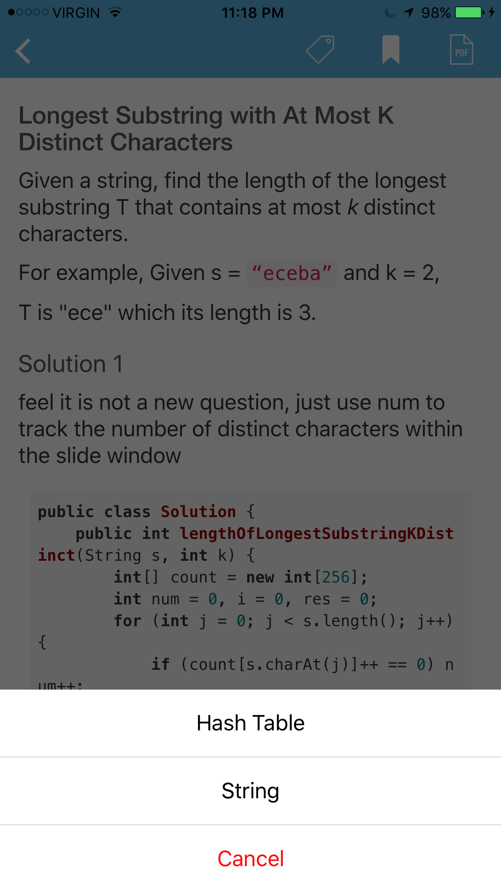

# SwiftyActionSheet

An alternative action sheet written in Swift. Inspired by the action sheet in Wechat and Weibo.



BTW, the App in the image is [Leetcoder](https://itunes.apple.com/app/leetcoder/id1069760709?mt=8).

## Usage

The usage is pretty simple:
```swift
let tags = ["String", "Hash Table"]
let popUp = SwiftyActionSheet()
for tag in tags {
    popUp.addbutton(tag) {
        print(tag)
    }
}
popUp.show()
```

## License

MIT
